# 1. AzureExamples
Examples for Azure-based applications

<!-- TOC -->

- [1. AzureExamples](#1-azureexamples)
	- [1.1. Azure Account](#11-azure-account)
	- [1.2. Create App Service](#12-create-app-service)
		- [1.2.1. App Service Selection](#121-app-service-selection)
		- [1.2.2. App Service Creation](#122-app-service-creation)
			- [1.2.2.1. Database Server Creation](#1221-database-server-creation)
			- [1.2.2.2. App Creation Completion](#1222-app-creation-completion)
		- [1.2.3. Database Server Configuration](#123-database-server-configuration)
		- [1.2.4. References](#124-references)
	- [1.3. Unrelated References](#13-unrelated-references)

<!-- /TOC -->

## 1.1. Azure Account

Create an Azure account by going [here](https://azure.microsoft.com/en-us/free/search/?&OCID=AID631184_SEM_EvHPyxxw&lnkd=Google_Azure_Brand&gclid=Cj0KCQjwgMnYBRDRARIsANC2dfkzW0eWXzskpSAK8bKY8BvhDeG9EFA6kyCyT4Vbik6aDUZ3b_uJYuYaAvuyEALw_wcB) or [here](http://lmgtfy.com/?q=azure).

Sign in to your account [here](https://login.microsoftonline.com/common/oauth2/authorize?client_id=15689b28-1333-4213-bb64-38407dde8a5e&response_mode=form_post&response_type=code+id_token&scope=openid+profile&state=OpenIdConnect.AuthenticationProperties%3dr5KFXId_-aWSUaswGpk5dvg3IFm87dNC9w7wIoK-ypopkk0WKIxN1KxraNEAEg68ht5XjCGOe1Uf4PJpt_CqLkQ9B6hy9-rc79IorGyGnvvz1TH_y5va2yKULw1fhS9Kbg-tEjgQcn2Jo5ydD70GVemWKTm0I92Dgh6_45jf43GcJ5MFENpIqf1zoxH5kOsDjkLY1Q&nonce=636635365046633799.YzJiMjI5YjEtODlhZS00OTRkLWFlMzQtMzllZjM0YWUyZDcyY2M2ZGY3YzgtYmRlYS00OTk4LWEwMDUtOGYzNzE4MjFlYjhh&redirect_uri=https%3a%2f%2faccount.azure.com%2fSubscriptions%3fcorrelationId%3d2ae8e513-f401-4255-b542-8fff0467f763&max_age=3600&post_logout_redirect_uri=https%3a%2f%2faccount.azure.com&msafed=1&lw=1&fl=easi2).

- Depending on your account, it will show up as one of the following.

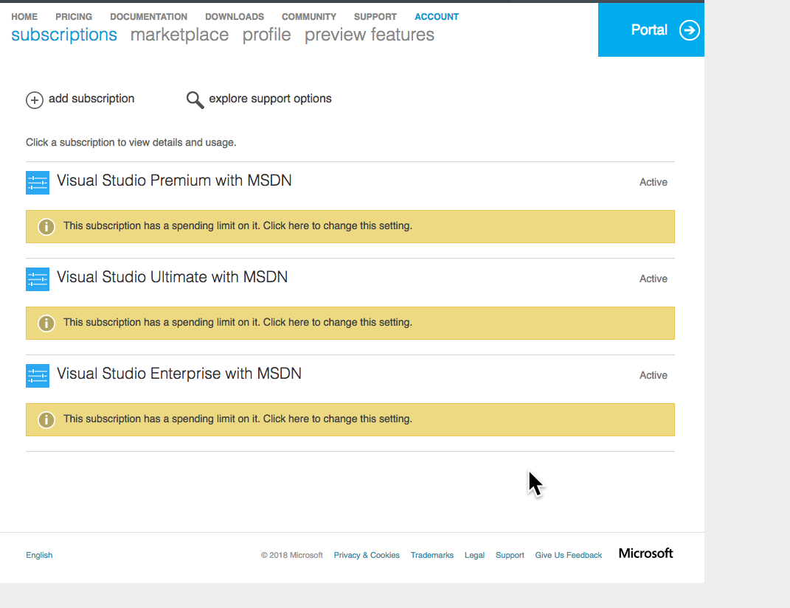

Once we click on Portal, we see the following: (this is after we create all resources, initially it will be empty)

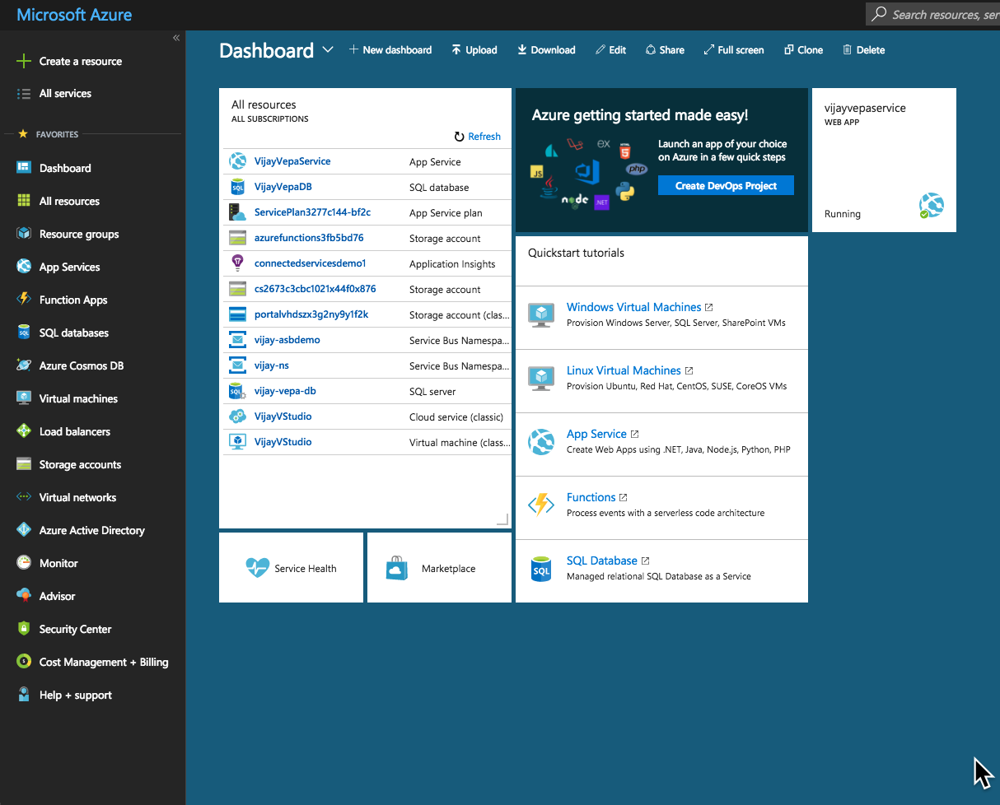

During this exercise we have created the following resources:

- VijayVepaService - An .net core application hosted on Azure
- VijayVepaDB - A SQL Server database hosted on Azure

Other resources were created earlier during different walkthroughs.

## 1.2. Create App Service

### 1.2.1. App Service Selection
1. Go to [App Services]() and Click [Add](). It will show the following screen.

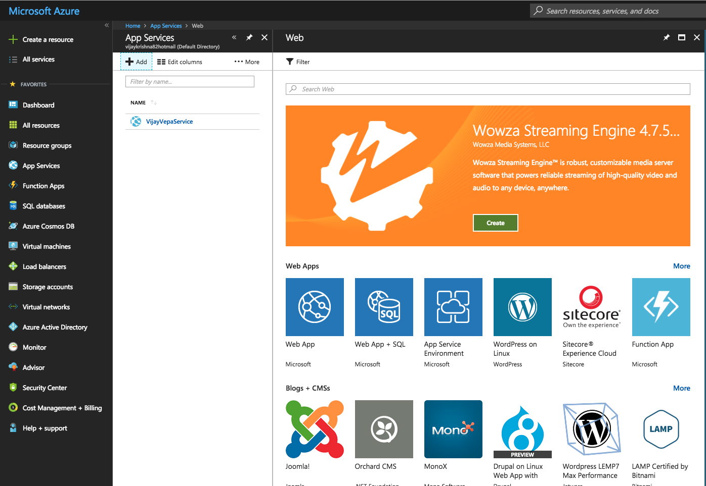

2. Click on [Web App + SQL]() and click on [Create]()

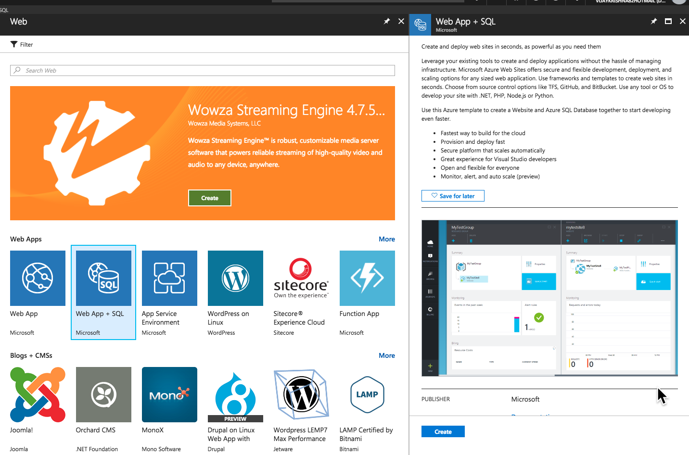

### 1.2.2. App Service Creation

3. Enter a name for the app service. It will populate other fields automatically.

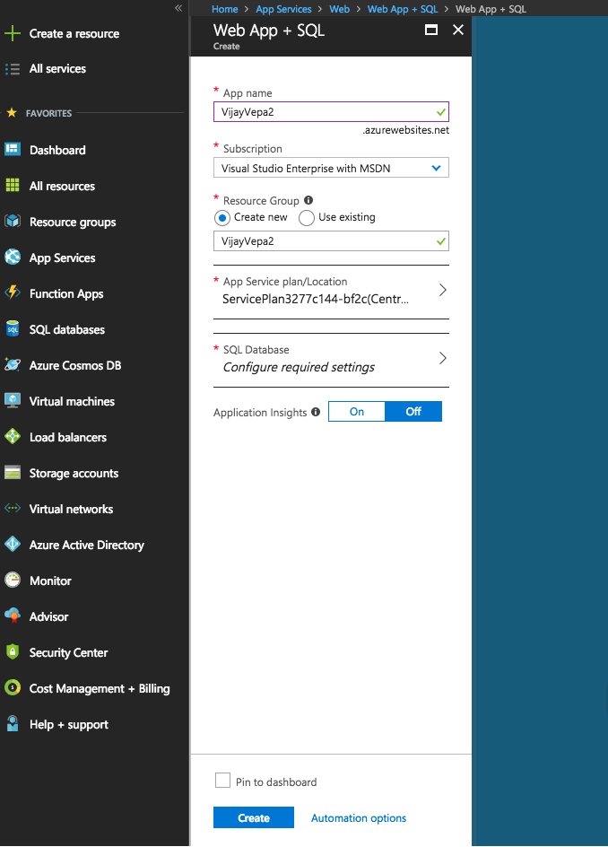

When you click on Create, it prompts you to configure SQL

#### 1.2.2.1. Database Server Creation

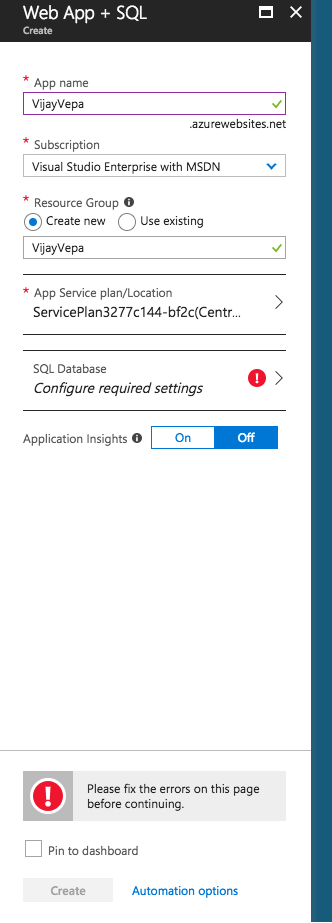

Click on SQL Database, and click on Create a Database

Enter appropriate values as below (example):

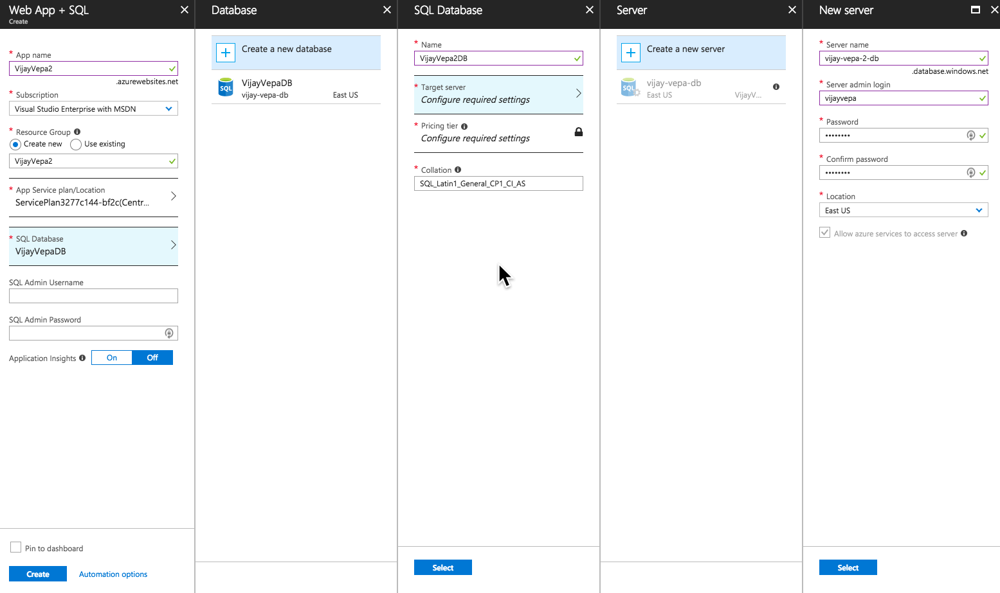

Click on [Select](), [Select]() and then [Create](). It will create the app on the web site in a couple of minutes.

#### 1.2.2.2. App Creation Completion

1. Once you go to the dashboard and click on newly created service, it will show up as below:

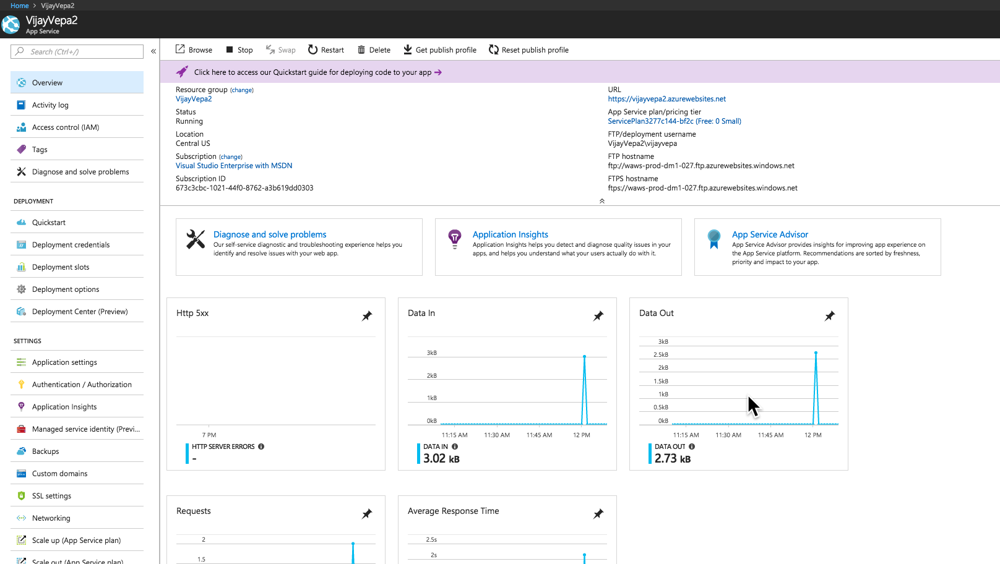

2. Click on the [URL](). It will show the following.

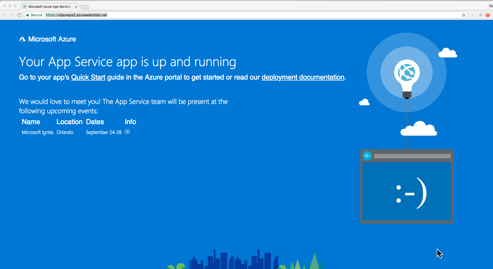

### 1.2.3. Database Server Configuration

Go to the newly created database and change its pricing tier to [Free]() by clicking [Configure]() or [Pricing tier]()

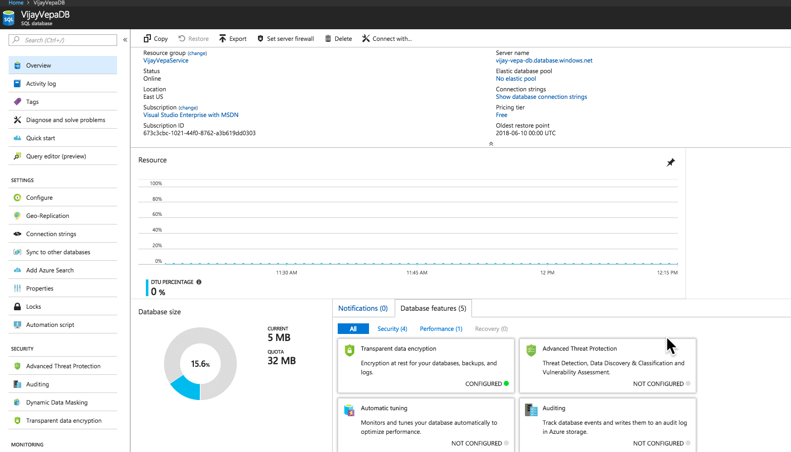

Choose Free Tier and Save. (It is very tiny 32MB database, only available for first DB)

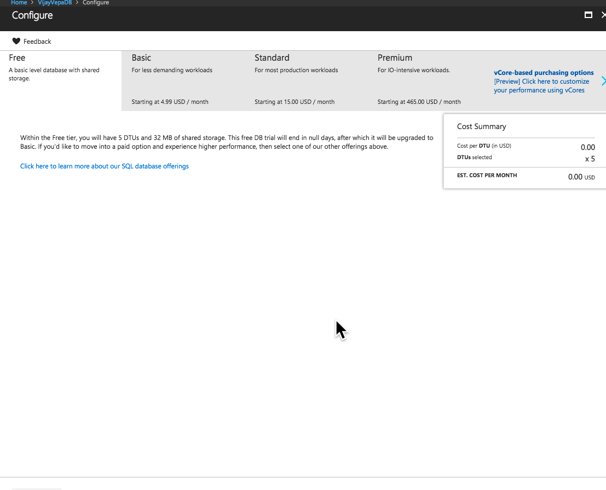

- Next Step: Get your code on to the website.

### 1.2.4. References
- [WebApps Documentation](https://docs.microsoft.com/en-us/azure/app-service/)
- Create an application using [.NET with Azure SQL DB](https://docs.microsoft.com/en-us/azure/app-service/app-service-web-tutorial-dotnet-sqldatabase)

## 1.3. Unrelated References

Honorable mentions for a later day:

- [Azure CosmosDB](https://portal.azure.com/?whr=live.com#blade/HubsExtension/Resources/resourceType/Microsoft.DocumentDb%2FdatabaseAccounts)

- [Azure Cosmos DB Example](https://github.com/Azure-Samples/azure-cosmos-db-mongodb-dotnet-getting-started/tree/master/MyTaskListApp)

- [Azure Cosmos DB Mongo Example](https://github.com/Azure-Samples/azure-cosmos-db-mongodb-dotnet-getting-started)